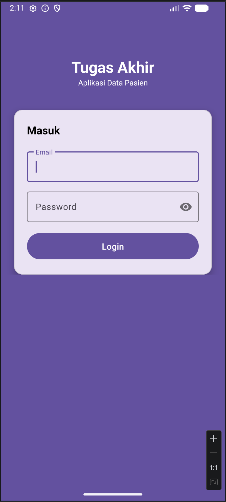
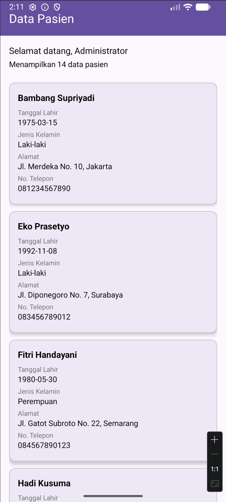

# Tugas Akhir - Aplikasi Data Pasien

Aplikasi Android untuk mengelola data pasien dengan fitur login dan menampilkan daftar pasien.

## Fitur

- **Login** - Autentikasi pengguna menggunakan email dan password
- **Daftar Pasien** - Menampilkan data pasien dalam bentuk daftar (RecyclerView)
- **Token Management** - Menyimpan token autentikasi secara lokal

## Teknologi

- **Bahasa**: Kotlin
- **Min SDK**: 26
- **Target SDK**: 36
- **Arsitektur**: MVVM (sederhana)
- **Networking**: Retrofit + OkHttp
- **Parsing JSON**: Gson
- **UI**: ViewBinding, Material Design
- **Coroutines**: Untuk async operations

## Struktur Proyek

```
app/src/main/java/com/example/tugasakhir/
├── App.kt                    # Application class
├── MainActivity.kt           # Main activity
├── data/
│   ├── api/
│   │   ├── ApiService.kt     # Retrofit API interface
│   │   └── RetrofitClient.kt # Retrofit singleton
│   ├── local/
│   │   └── TokenManager.kt   # SharedPreferences token manager
│   └── model/
│       ├── LoginResponse.kt  # Model login
│       └── PasienResponse.kt # Model pasien
└── ui/
    ├── login/
    │   └── LoginActivity.kt  # Halaman login
    └── pasien/
        ├── PasienActivity.kt # Halaman daftar pasien
        └── PasienAdapter.kt  # Adapter RecyclerView
```

## Screenshots

| Halaman Login | Daftar Pasien |
|:-------------:|:-------------:|
|  |  |

## Cara Menjalankan

1. Clone repositori ini
2. Buka dengan Android Studio
3. Sync project dengan Gradle
4. Jalankan di emulator atau perangkat fisik (min SDK 26)

## API

Aplikasi ini menggunakan REST API di `https://api.pahrul.my.id/` dengan endpoint:

- `POST /api/login` - Login pengguna
- `GET /api/pasien` - Mengambil data pasien (memerlukan token Bearer)
